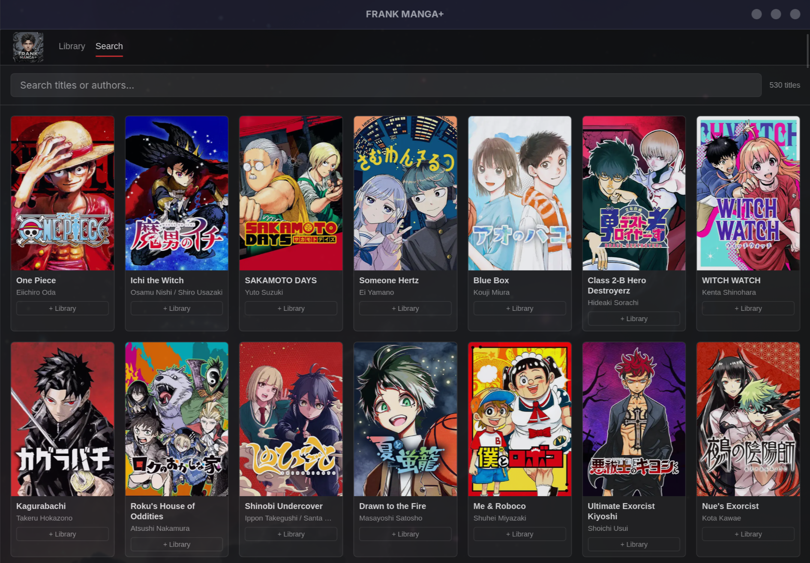
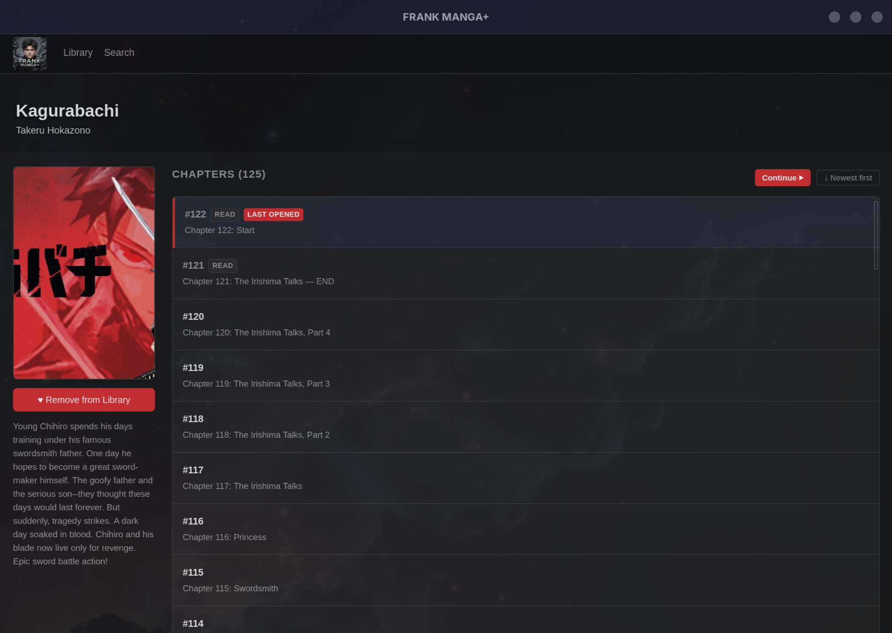
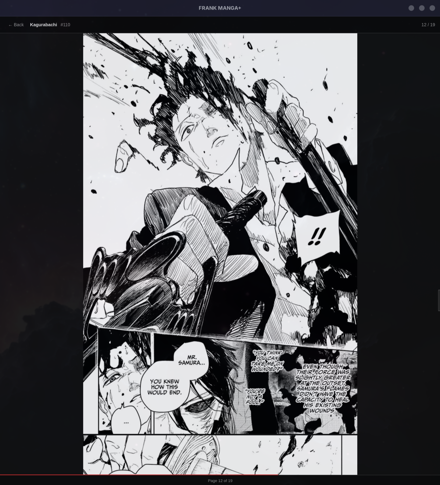
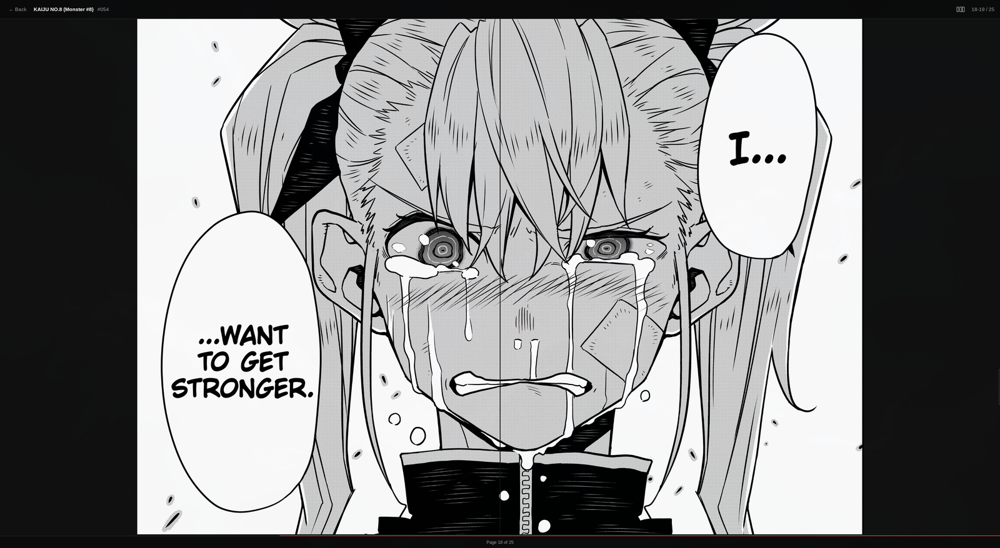
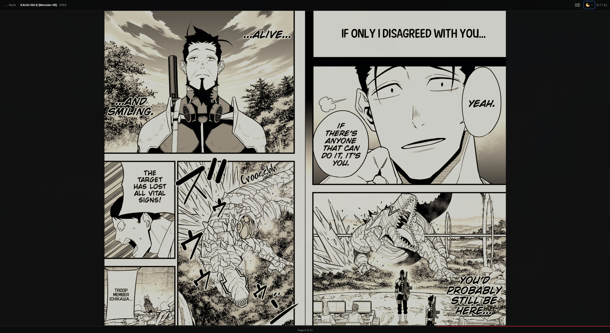

<div align="center">
  

  <h1>FRANK MANGA+</h1>

  <p>
    <strong>A personal-use desktop reader for <a href="https://mangaplus.shueisha.co.jp/">MANGA Plus by Shueisha</a>.</strong><br>
    Read on Linux, macOS, and Windows. Free tier works out of the box; paste a subscriber secret for premium chapters.
  </p>

  <p>
    <a href="https://github.com/akitaonrails/frank_mangaplus/releases/latest">Latest release</a>
    ·
    <a href="docs/install.md">Install guide</a>
    ·
    <a href="docs/android-secret.md">Get your secret</a>
    ·
    <a href="docs/debugging.md">Contributors</a>
  </p>

  <p>
    <a href="https://github.com/akitaonrails/frank_mangaplus/actions/workflows/ci.yml"></a>
    <a href="https://github.com/akitaonrails/frank_mangaplus/releases"></a>
    
    
  </p>
</div>

---

## What it looks like

| Library / Search | Title detail | Reader |
|:---:|:---:|:---:|
|  |  |  |
| Your bookmarked titles, plus the full catalog if you want to browse. | Banner art, synopsis, the chapter list (virtualized — One Piece has 1100+ and it still scrolls fine). | Single-page mode: one page snapped to the viewport. Left half of the page advances (manga RTL), right half goes back. |

### Double-page mode

Press `D` (or click the layout icon in the header) and the reader pairs facing pages so a two-page spread fills the screen the way it was drawn:



Three layouts cycle on the toggle:
- **single** — one page at a time
- **double** — sequential pairs from page 1
- **double-cover** — first page of each chapter solo, then pairs (matches printed manga where the cover binds singly before the first spread)

The choice persists across chapters and sessions.

### Night-reading sepia filter

Press `F` (or click the crescent-moon icon in the header) to warm the page whites toward sepia. Bright LCD whites get harsh in the dark — this softens them without flattening contrast:



Four levels cycle on the toggle: **off → low → med → high → off**. The button tints amber and shows one to three dots to indicate the active level. Persisted in localStorage like the other reader prefs.

Implemented as a CSS `sepia + brightness + saturate` filter on the whole page-stack — sepia shifts the hue toward amber while preserving the luminance range, so blacks stay black and the artwork's contrast is intact.

---

## Why this exists

I pay for MANGA Plus and I wanted to read it on a desktop. Shueisha doesn't ship a desktop client. So you have two choices: sideload the Android app onto a tablet (works, but a tablet is a tablet), or squint at your phone. This is option three.

Under the hood it's the same API the official Android app uses. By default the app registers itself as a fresh device on first launch — same flow the official app uses when you install it — so you get free-tier access to the catalog out of the box. If you're already a paid subscriber and want subscription chapters on desktop, you can paste your phone's `deviceSecret` into the app to swap in your subscriber session. Nothing about the paywall is bypassed.

## What you need

Just a downloaded binary. Launch it, and the app registers itself with the official API on first run. That gives you free-tier access to everything MANGA Plus shows for free — the entire catalog, latest and first chapters of every series, the free-rotation backlog.

If you also want subscription-locked chapters on desktop:

- An active MANGA Plus subscription on a phone install.
- Your `deviceSecret` from that install. 5 minutes if your phone is rooted (`adb shell`), about 20 if it isn't (rooted Android emulator on your desktop — walkthrough in [docs/android-secret.md](docs/android-secret.md)).
- Paste it into the app's settings. Replaces the free-tier session with your subscriber one.

## Install

Grab the build for your OS from the [Releases page](https://github.com/akitaonrails/frank_mangaplus/releases/latest):

| OS | File |
|---|---|
| Linux (AppImage) | `FRANK.MANGA+_*_amd64.AppImage` |
| Linux (.deb) | `FRANK.MANGA+_*_amd64.deb` |
| Linux (Arch) | `yay -S mangaplus-reader-bin` |
| macOS (Apple Silicon) | `FRANK.MANGA+_*_aarch64.dmg` |
| macOS (Intel) | `FRANK.MANGA+_*_x64.dmg` |
| Windows | `FRANK.MANGA+_*_x64-setup.exe` |

Long-form install doc: [docs/install.md](docs/install.md).

On first launch the app calls the official `/register` endpoint and is issued a fresh free-tier `deviceSecret`. That gets saved locally and you're reading the catalog. If you're a paid subscriber and want subscription chapters too, open Settings and paste your phone-extracted `deviceSecret` to upgrade.

## What's in it

A library view of your bookmarked titles. The search page hits the full English catalog and filters locally as you type.

Title detail shows the banner art, the synopsis, and the full chapter list. The list is virtualized, so a series with a thousand chapters scrolls fine. There's a sort toggle, and a "Continue ▶" button that jumps to the last chapter you opened.

The reader is page-fit and snap-scrolls. Click the left half of a page to advance, the right half to go back (manga RTL reading direction). Arrow keys, Space, j/k, PageUp/Down all work too. When you reach the end of a chapter the next one pre-fetches and appends to the scroll, so you don't have to bounce back to the chapter list every time. Per-chapter resume is automatic — leave mid-read and the next time you open that chapter you land on the page you stopped at.

Every page you load gets cached to `~/.cache/mangaplus-reader/`. Re-opening the same chapter is instant after the first read.

Read state lives in localStorage. The chapter list marks whichever chapter you stopped at with a "Last opened" badge, and the title page surfaces a link back to it.

## How it works

```
┌─────────────────────────────┐      ┌──────────────────────────┐
│  Tauri WebView (SvelteKit)  │      │  Rust client (reqwest)   │
│                             │      │                          │
│  Library / Search / Reader  │◄────►│  get_chapter_pages…      │
│        │      │  get_title_detail…       │
└──────────┬──────────────────┘      │  fetch_image (cookies,   │
           │                         │       okhttp UA, cache)  │
           │ mpimg:// scheme         └────────────┬─────────────┘
           │ intercepted by Tauri                 │
           └─────────────────────────────────────►│ HTTPS
                                                  ▼
                                       jumpg-api.tokyo-cdn.com
                                       jumpg-assets3.tokyo-cdn.com
```

`mangaplus-api` is a pure Rust crate with fixture-based tests. It does the protobuf decode, the cookie threading, and the `plus_vw_token` handshake the premium image CDN expects. No Tauri deps.

`mangaplus-desktop` is the Tauri 2 + SvelteKit app. Image URLs go through an `mpimg://` custom URI scheme that proxies the request back through the same Rust client. That's how the cookies survive the WebView/Rust boundary.

Every request goes directly to Shueisha's CDN, no proxy in between.

If you don't trust a random binary on the internet to do that honestly (you shouldn't), the actual on-the-wire format — every header, every gotcha I hit reverse-engineering this — is written up in [docs/debugging.md](docs/debugging.md). You can verify it yourself.

## Documentation

- [`docs/install.md`](docs/install.md): end-user install. Free-tier auto-register and the optional subscriber upgrade.
- [`docs/android-secret.md`](docs/android-secret.md): the rooted-AVD walkthrough for extracting a subscriber `deviceSecret`. Doesn't touch your phone.
- [`docs/debugging.md`](docs/debugging.md): contributor notes. mitmproxy, Frida, the real headers, what tripped me up.

## Disclaimer

Not affiliated with Shueisha or Manga Plus. The default fresh-register flow reproduces the same handshake the official Android app performs on a new install — it grants free-tier access only. Subscription-locked content requires pasting in a `deviceSecret` extracted from your own paid phone install. No paywall, subscription, or DRM is bypassed.

## License

MIT.
